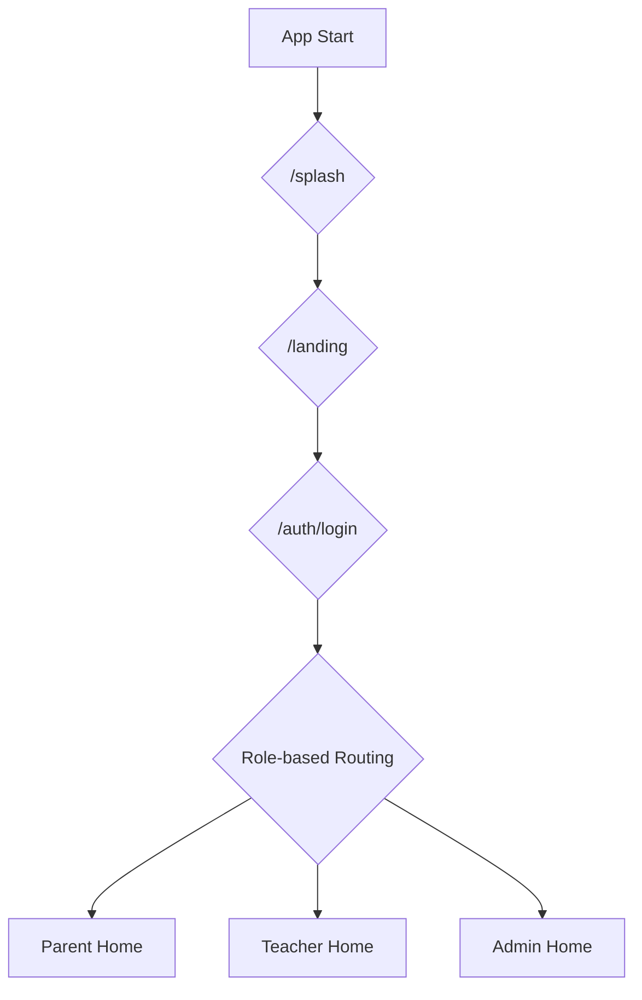

# Lumi Reading App - Screen Flow and Navigation

This document outlines the navigation flow of the Lumi Reading App. It's structured by user roles and major application sections.

## 1. Initial App Flow (Entry Points)

- **`/splash` (SplashScreen):** Initial loading screen.
- **`/landing` (LandingScreen):** Marketing/welcome page.
- **`/auth/login` (LoginScreen):** User login. From here, users are routed based on their role.

---

## 2. Authentication Flow

- **`/auth/login` (LoginScreen):**
    - **Action:** Click "Register" -> **Navigate to:** `/auth/register` (RegisterScreen)
    - **Action:** Click "Forgot Password" -> **Navigate to:** `/auth/forgot-password` (ForgotPasswordScreen)
- **`/auth/register` (RegisterScreen):**
    - **Action:** Select "Parent" role -> **Navigate to:** `/auth/parent-register` (ParentRegistrationScreen)
- **`/auth/parent-register` (ParentRegistrationScreen):**
    - Parent-specific registration form.
- **`/auth/forgot-password` (ForgotPasswordScreen):**
    - Form to reset password.
- **`/auth/web-not-available` (WebNotAvailableScreen):**
    - Shown to parents trying to use the web version.

---

## 3. Onboarding Flow

- **`/onboarding/school-registration` (SchoolRegistrationWizard):**
    - Multi-step form for new schools to register.
- **`/onboarding/demo` (SchoolDemoScreen):**
    - A demo version of the school features.
- **`/onboarding/demo-request` (DemoRequestScreen):**
    - Form to request a demo.

---

## 4. Parent User Flow (Mobile Only)

### Parent Home Hub: `/parent/home` (ParentHomeScreen)
This screen has a 3-tab Bottom Navigation:

- **Today Tab:**
    - **Action:** Click "Log Reading" button -> **Navigate to:** `/parent/log-reading` (LogReadingScreen)
    - **Action:** Click "View Goals" -> **Navigate to:** `/parent/student-goals` (StudentGoalsScreen)
    - **Action:** Click book in reading list -> **Navigate to:** `/parent/book-browser` (BookBrowserScreen)
- **History Tab:**
    - **Action:** View past reading -> **Navigate to:** `/parent/reading-history` (ReadingHistoryScreen)
- **Profile Tab:**
    - **Action:** Click "Achievements" -> **Navigate to:** `/parent/achievements` (AchievementsScreen)
    - **Action:** Click "Reminder Settings" -> **Navigate to:** `/parent/reminder-settings` (ReminderSettingsScreen)
    - **Action:** Click "Offline Management" -> **Navigate to:** `/parent/offline-management` (OfflineManagementScreen)
    - **Action:** Click "Student Reports" -> **Navigate to:** `/parent/student-report` (StudentReportScreen)
    - **Action:** Click "Edit Profile" -> **Navigate to:** `/parent/profile` (ParentProfileScreen)

### Other Parent Screens:
- **`/parent/log-reading` (LogReadingScreen):** Form to log reading activity.
- **`/parent/reading-history` (ReadingHistoryScreen):** Detailed view of past reading.
- **`/parent/student-goals` (StudentGoalsScreen):** View and manage student goals.
- **`/parent/achievements` (AchievementsScreen):** View awards and achievements.
- **`/parent/reminder-settings` (ReminderSettingsScreen):** Configure reading reminders.
- **`/parent/offline-management` (OfflineManagementScreen):** Manage offline data.
- **`/parent/student-report` (StudentReportScreen):** Detailed student progress report.
- **`/parent/profile` (ParentProfileScreen):** Edit parent profile.
- **`/parent/book-browser` (BookBrowserScreen):** Browse for books.

---

## 5. Teacher User Flow

### Teacher Home Hub: `/teacher/home` (TeacherHomeScreen)
This screen has a 4-tab Bottom Navigation:

- **Dashboard Tab:**
    - Overview of class activities.
- **Classes Tab:**
    - **Action:** Click on a class -> **Navigate to:** `/teacher/class-detail/:classId` (ClassDetailScreen)
    - **Action:** Click "Reading Groups" -> **Navigate to:** `/teacher/reading-groups` (ReadingGroupsScreen)
- **Allocate Tab:**
    - **Action:** Opens allocation screen -> **Navigate to:** `/teacher/allocation` (AllocationScreen)
- **Profile Tab:**
    - **Action:** Click "Class Reports" -> **Navigate to:** `/teacher/class-report` (ClassReportScreen)
    - **Action:** Click "Edit Profile" -> **Navigate to:** `/teacher/profile` (TeacherProfileScreen)

### Other Teacher Screens:
- **`/teacher/allocation` (AllocationScreen):** Allocate books to students.
- **`/teacher/class-detail/:classId` (ClassDetailScreen):** Detailed view of a class.
- **`/teacher/reading-groups` (ReadingGroupsScreen):** Manage reading groups within a class.
- **`/teacher/class-report` (ClassReportScreen):** View and generate class reports.
- **`/teacher/profile` (TeacherProfileScreen):** Edit teacher profile.

---

## 6. Admin User Flow

### Admin Home Hub: `/admin/home` (AdminHomeScreen)
This screen has a 5-tab Bottom Navigation:

- **Dashboard Tab:**
    - High-level school analytics.
    - **Action:** Click for more details -> **Navigate to:** `/admin/analytics` (SchoolAnalyticsDashboard)
- **Users Tab:**
    - **Action:** Manage users -> **Navigate to:** `/admin/user-management` (UserManagementScreen)
- **Classes Tab:**
    - **Action:** Manage classes -> **Navigate to:** `/admin/class-management` (ClassManagementScreen)
    - **Action:** Manage students in classes -> **Navigate to:** `/admin/student-management` (StudentManagementScreen)
- **Settings Tab:**
    - **Action:** Click "Parent Linking" -> **Navigate to:** `/admin/parent-linking` (ParentLinkingManagementScreen)
    - **Action:** Click "Database Migration" -> **Navigate to:** `/admin/database-migration` (DatabaseMigrationScreen)
- **Profile Tab:**
    - Standard profile settings.

### Other Admin Screens:
- **`/admin/user-management` (UserManagementScreen):** Manage all users in the school.
- **`/admin/student-management` (StudentManagementScreen):** Manage student accounts.
- **`/admin/class-management` (ClassManagementScreen):** Manage classes.
- **`/admin/analytics` (SchoolAnalyticsDashboard):** Detailed school analytics.
- **`/admin/parent-linking` (ParentLinkingManagementScreen):** Manage links between parents and students.
- **`/admin/database-migration` (DatabaseMigrationScreen):** Tools for database migration.
